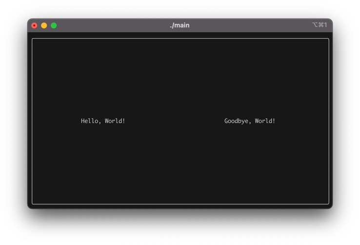
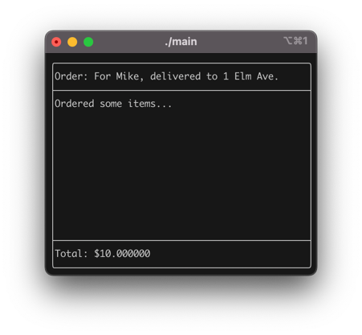
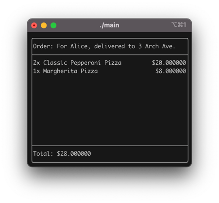

# Contents
- [Contents](#contents)
- [Journal](#journal)
  - [Core Functionality](#core-functionality)
    - [Project Setup](#project-setup)
    - [Simple tests](#simple-tests)
    - [Added a README](#added-a-readme)
    - [Storing multiple `Order`s](#storing-multiple-orders)
    - [A better `OrderList`](#a-better-orderlist)
    - [Documentation](#documentation)
    - [Exporting `OrderList`s to a file (and import, too)](#exporting-orderlists-to-a-file-and-import-too)
    - [Better export](#better-export)
    - [`MenuItem`s](#menuitems)
    - [`Order`s can calculate their own price](#orders-can-calculate-their-own-price)
    - [`OrderItem`s](#orderitems)
    - [JSON export](#json-export)
    - [JSON import](#json-import)
    - [A Menu](#a-menu)
    - [Importing and exporting a Menu](#importing-and-exporting-a-menu)
  - [UI](#ui)
    - [Finally, a UI](#finally-a-ui)
    - [Trying it on Windows](#trying-it-on-windows)
    - [Rendering an `Order`](#rendering-an-order)
    - [Rendering the items](#rendering-the-items)
    - [Formatting the prices nicely](#formatting-the-prices-nicely)

# Journal
## Core Functionality
### Project Setup
I set up a git repository, and initialised a new [CMake](https://cmake.org) project. I made two directories `src` and `tests`.

In the `src` directory, we will have all our files, from classes to `main.cpp` itself. The `tests` directory will contain unit tests for our classes, and will be run with [CTest](https://cmake.org/cmake/help/latest/manual/ctest.1.html).

I ignore compiled CMake build files in the [.gitignore](.gitignore) file, since these are OS-specific.

### Simple tests

I then set up an *extremely* simple `Order` class, which literally just holds a description, and set up a super simple test in [tests/test_new_order.cpp](tests/test_new_order.cpp). In order to do this, I also set up some simple macros which will be useful for testing later on. These can be found at [tests/macros.cpp](tests/macros.cpp).

```cpp
// tests/test_new_order.cpp
Order order("One pepperoni pizza for Mike, delivered to 1 Elm Ave.");
ASSERT_EQUAL_STR(order.getDescription(), "One pepperoni pizza for Mike, delivered to 1 Elm Ave.");
return 0;
```

For now, [src/main.cpp](src/main.cpp) is just a 'hello world' program, since I was focusing on setting up the tests first.

### Added a README
Added a [README.md](README.md) file, which contains a brief overview of the project, and instructions on how to build and run the project. I also added a [task.pdf](task.pdf) file, which contains the task requirements for the project.

### Storing multiple `Order`s
Having a single order is great, but we need to be able to store multiple orders. I added a `OrderList` class, which is a simple wrapper around a `std::vector<Order>`. For now, it does nothing fancy. I also added a test for this class, which is in [tests/test_new_order.cpp](tests/test_new_order.cpp):
```cpp
// tests/test_new_order.cpp
void create_order_list() {
  OrderList list{};
  ASSERT(list.size() == 0);
  Order order1("One pepperoni pizza for Mike, delivered to 1 Elm Ave.");
  Order order2("Two pepperoni pizzas for Alice, delivered to 3 Arch Ave.");
  
  list.pushOrder(order1);
  list.pushOrder(order2);
  ASSERT(list.size() == 2);
  ASSERT(list.getOrder(0).getDescription() == "One pepperoni pizza for Mike, delivered to 1 Elm Ave.");
  ASSERT(list.getOrder(1).getDescription() == "Two pepperoni pizzas for Alice, delivered to 3 Arch Ave.");
  list.erase(0);
  ASSERT(list.size() == 1);
  ASSERT(list.getOrder(0).getDescription() == "Two pepperoni pizzas for Alice, delivered to 3 Arch Ave.");
}
```
Note that I also created a new and improved `ASSERT` macro, with much better fail messages. This is in [tests/macros.cpp](tests/macros.cpp).

### A better `OrderList`
Rather than store the orders in a [std::vector](https://en.cppreference.com/w/cpp/container/vector), I realised it would be beneficial to use a [std::list](https://en.cppreference.com/w/cpp/container/list) instead. This is because we will be adding and removing orders frequently, and a `std::list` is much better at this than a `std::vector`. It doesn't hinder us much, since we don't need random access anyway.

Along with this, I added a `find` method to the `OrderList` class, which will return an iterator to the first order which contains the keyword in the description. This is useful for searching for orders by name, for example. These features are tested in two new files: [tests/test_order_list_erase.cpp](tests/test_order_list_erase.cpp) and [tests/test_order_list_find.cpp](tests/test_order_list_find.cpp).

In order to test these, I also added a new `ASSERT_THROWS` macro, used like so:
```cpp
// tests/test_order_list_erase.cpp
void doesnt_exist() {
  OrderList list{};
  list.pushOrder(Order("One pepperoni pizza for Mike, delivered to 1 Elm Ave."));
  list.pushOrder(Order("Two pepperoni pizzas for Alice, delivered to 3 Arch Ave."));
  ASSERT_THROWS(list.erase(list.find("Bob")), std::invalid_argument);
}
```

### Documentation
I added documentation to the [Order](src/core/order.h) and [OrderList](src/core/order_list.h) classes, using [Doxygen](https://www.doxygen.nl/index.html)-style comments. This allows my IDE to show me the documentation when I hover over a class or method, and will also allow me to generate documentation if I want to later on.
```cpp
/**
* @brief Find the first order that matches a given keyphrase.
*
* This method searches the descriptions of the orders for the given keyphrase
* and returns an iterator to the first matching order.
*
* @param keyphrase The keyphrase to search for.
* @return std::list<Order>::iterator An iterator to the found order, or end() if not found.
*/
std::list<Order>::iterator find(const std::string& keyphrase);
```

### Exporting `OrderList`s to a file (and import, too)
In a real restaurant, we're going to want to have multiple people with access to the same list of orders, and also we'll be opening and closing sessions all the time.

I added the functionality to export an `OrderList` to a file, and also to import/read from a file. This is done in a very simple way for now, simply treating each order as a separate line, in a .txt file. Of course, this comes with its own tests in [tests/test_import_export_orders.cpp](tests/test_import_export_orders.cpp).

Here's what a sample exported order looks like:
```text
One pepperoni pizza for Mike, delivered to 1 Elm Ave.
Two pepperoni pizzas for Alice, delivered to 3 Arch Ave.
```

### Better export
I realised that the previous export method was not very good, since it would not work if the description of an order contained a newline character. I changed the export to escape newline characters as `\n`, and also to escape backslashes as `\\`. Now orders with multiline descriptions can be exported and imported correctly:
```text
One peppero\\ni pizza for Mike,\ndelivered to \\1 Elm Ave.\\"\\
Two pepperoni \n\npizzas for "Alice", delivered to 3 Arch Ave.
```

### `MenuItem`s
I added a `MenuItem` class, which is a simple class that holds a name and a price. Orders now contain a list of `MenuItem`s, in addition to a description, such as "For Mike" (although I will remove the description later).

### `Order`s can calculate their own price
Finally, `Order` has the functionality to do something that isn't entirely trivial for a regular employee with a notepad: calculate the price of the order. This is done by summing the prices of all the `MenuItem`s in the order. This is tested in [tests/test_order_price.cpp](tests/test_order_price.cpp).

```cpp
double Order::calculateTotalPrice() const {
    double total = 0;
    for (const auto &item : items) {
        total += item.getPrice();
    }
    return total;
}
```

### `OrderItem`s
I realised that `MenuItem`s are not very useful on their own, since they don't have a quantity. Also, maybe a particular item will have extra requests, such as "no olives" or something. I added an `OrderItem` class, which is a `MenuItem` with a quantity (and in future will also hold special notes / requirements). This is a pretty big non-backwards-compatible change and required rewriting all my tests to support this new structure.

```cpp
void TEST_higher_quantity() {
    Order order("For Mike");
    MenuItem pepperoni("Classic Pepperoni Pizza", 10.0);
    MenuItem margherita("Margherita Pizza", 9.0);

    order.addItem(OrderItem(pepperoni, 2));
    order.addItem(OrderItem(margherita, 1));

    ASSERT(order.calculateTotalPrice() == 29.0);
}
```

### JSON export
If we want to be able to export these new, fancier orders, we need a better way to do it. Considering that an `OrderList` contains sub-objects `Order` which contain sub-objects `OrderItem` which contain sub-objects `MenuItem`, I decided to use JSON as the export format. I found a library called [nlohmann/json](https://github.com/nlohmann/json) which seems to suit my purpose really well.

I'm gradually phasing out the old functionality and replacing it with this, starting with first the ability to export an individual `MenuItem` to JSON, then an `OrderItem`, which makes use of the just-implemented `MenuItem` export. Then the functionality to export an `Order` to JSON, which uses an array of the `OrderItem` exports, as well as exporting the `description` string. Finally, I export an array of such `Order`s as an `OrderList`.

The export functionality is getting complex enough now that I decided to make two classes, [MenuParser](src/core/menu_parser.h) and [OrderParser](src/core/order_parser.h), which are responsible for exporting and importing `MenuItem`s and `Order`s, respectively. This is tested in [tests/test_import_export_orders.cpp](tests/test_import_export_orders.cpp), replacing the tests that used to be there (back when we did each order on its own line).

### JSON import
Now that we can export to JSON, we obviously need a way to import our `OrderList`s back. I added the functionality to do this, and also added a test for it in [tests/test_import_export_orders.cpp](tests/test_import_export_orders.cpp). An exported `OrderList` file looks something like this:

```json
{
  "orders": [
    {
      "description": "For Mike, delivered to 1 Elm Ave.",
      "items": [
        {
          "item": {
            "name": "Classic Pepperoni Pizza",
            "price": 10.0
          },
          "quantity": 1
        }
      ]
    },
    {
      "description": "For Alice, delivered to 3 Arch Ave.",
      "items": [
        {
          "item": {
            "name": "Classic Pepperoni Pizza",
            "price": 10.0
          },
          "quantity": 2
        }
      ]
    }
  ]
}
```

### A `Menu`
Before I get into making a UI, I first wanted to make one more thing: a [Menu](src/core/menu.h). This is a list of `MenuItem`s, which can be searched with queries such as `"pepperoni"`, so that `Order`s can be built from pre-existing `MenuItem`s, with already defined names and costs. This is tested in [tests/test_menu.cpp](tests/test_menu.cpp).

### Importing and exporting a `Menu`
I added the functionality to import and export a `Menu` to and from a JSON file. This is basically the same as the way I export `OrderList`s. This is tested in [tests/test_import_export_menu.cpp](tests/test_import_export_menu.cpp). A `Menu` JSON file looks like this:

```json
{
  "items": [
    {
      "name": "Classic Pepperoni Pizza",
      "price": 10.0
    },
    {
      "name": "Classic Margherita Pizza",
      "price": 9.0
    },
    {
      "name": "Hawaiian Pizza",
      "price": 12.0
    },
    {
      "name": "Veggie Pizza",
      "price": 11.0
    }
  ]
}
```

## UI
### Finally, a UI
All that functionality is great, but it's not very useful without an interface. I decided to go with a terminal-based user interface (TUI). I wanted something like [ncurses](https://https://en.wikipedia.org/wiki/Ncurses). I've decided to use [FTXUI](https://github.com/ArthurSonzogni/FTXUI), at least for now. It's a C++ library for building terminal interfaces. I added this as a submodule to my project, and set up a super simple 'Hello World' interface, to get a feeling for how it works.

I refactored all the functionality I've been working on so far to a new directory [src/core](src/core), and added a new directory [src/ui](src/ui) for the user interface classes, which just contains a single `Tui` class for now. Here's what it looks like when it's run:


### Trying it on Windows
I tried running the project on Windows, and I managed to get it to work just as well as on macOS, which I've been using thus far. I've also played around with adding some interactive features, to see if they work and to get a feel for them. They worked on Windows as well with no extra changes.

### Rendering an `Order`
I think the first part of the UI I will create is the 'Kitchen' view. This will display all orders in the `OrderList`, and allow the employee to remove them once they're completed.

I added an `OrderRenderer` class, which is responsible for generating a `Renderer` component for an `Order`. It looks like this: (note that the items are not actually rendered yet, just a placeholder for now)


### Rendering the items
I added a `OrderItemRenderer` class, which is responsible for rendering an `OrderItem`. This is used by the `OrderRenderer` to render all the items in an `Order`. This is what it looks like:


### Formatting the prices nicely
All those zeros after the decimal point are not very nice. I added a [src/utils/utils.h](src/utils/utils.h) file, which contains a `formatPrice` function, which formats a price to two decimal places. This is used in the `OrderItemRenderer` and `OrderRenderer` to format the prices nicely (as `$10.00`). I also tested it in [tests/test_utils.cpp](tests/test_utils.cpp).